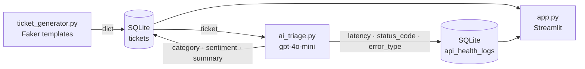
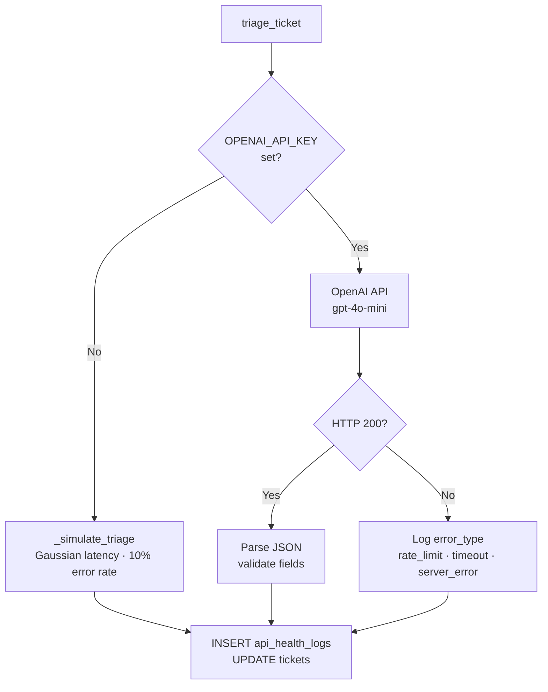

# SupportOps AI Monitor

[](https://github.com/Archit-Konde/supportops-ai-monitor/actions/workflows/lint-test.yml)

I wanted to understand what enterprise AI platform support actually looks like operationally — what kinds of tickets come in, how teams triage them at scale, and how API reliability gets measured day-to-day. This is what I built to find out.

It simulates a full support operations workflow: ticket generation, AI-powered triage via OpenAI, API health logging, and a live observability dashboard. Works completely in simulation mode with no API key required.

---

## What It Does

- **Generates realistic support tickets** — API errors, billing disputes, account issues, safety concerns — the kinds of things an AI platform support team actually deals with
- **AI triage** — classifies each ticket by category, analyses customer sentiment, and produces a one-line summary using `gpt-4o-mini`
- **API health monitoring** — logs every API call with latency, HTTP status code, and error type, mirroring how observability tools like Datadog or Splunk work
- **Operational dashboard** — Streamlit + Plotly charts for ticket volume, priority distribution, sentiment trends, API error rates, and latency over time
- **SQLite persistence** — all data stored locally and queryable

---

## Architecture



---

## Triage Flow



---

## Tech Stack

- **Python 3.11+**
- **Streamlit** — dashboard
- **SQLite** — local persistence
- **OpenAI API** (`gpt-4o-mini`) — ticket triage
- **Plotly** — charts
- **Pandas** — data handling
- **Faker** — realistic synthetic data

---

## Getting Started

```bash
# 1. Clone
git clone https://github.com/Archit-Konde/supportops-ai-monitor.git
cd supportops-ai-monitor

# 2. Install
pip install -r requirements.txt

# 3. Set up env (optional — app works without it in simulation mode)
cp .env.example .env
# Add OPENAI_API_KEY to .env if you want real triage

# 4. Run
streamlit run app.py
```

Opens at `http://localhost:8501`. Use the sidebar to generate and triage tickets.

---

## Simulation Mode

No API key needed. When `OPENAI_API_KEY` is absent, the app falls back to a simulation that models realistic API behaviour:

- **Latency** — Gaussian distribution (mean ~820ms, σ 200ms)
- **Error rate** — 10% failure rate across rate limits, server errors, and timeouts
- **HTTP status codes** — 200, 429, 500, 408 in realistic proportions

The full dashboard is demonstrable at zero cost.

---

## Database Schema

### `tickets`
| Column | Type | Description |
|--------|------|-------------|
| `ticket_id` | TEXT | Unique identifier (`TKT-XXXXXXXX`) |
| `created_at` | TEXT | ISO timestamp |
| `customer` | TEXT | Company name |
| `subject` | TEXT | Ticket subject |
| `body` | TEXT | Full description |
| `priority` | TEXT | `low` / `medium` / `high` / `critical` |
| `status` | TEXT | `open` / `in_progress` / `resolved` |
| `category` | TEXT | AI-assigned: `api` / `billing` / `account` / `safety` / `other` |
| `sentiment` | TEXT | AI-assigned: `positive` / `neutral` / `negative` |
| `ai_summary` | TEXT | One-line AI-generated summary |
| `resolved_at` | TEXT | Resolution timestamp |

### `api_health_logs`
| Column | Type | Description |
|--------|------|-------------|
| `timestamp` | TEXT | ISO timestamp of API call |
| `endpoint` | TEXT | API endpoint called |
| `status_code` | INTEGER | HTTP response code |
| `latency_ms` | REAL | Response time in milliseconds |
| `success` | INTEGER | `1` = success, `0` = failure |
| `error_type` | TEXT | `rate_limit` / `server_error` / `timeout` / `null` |
| `ticket_id` | TEXT | Associated ticket |

---

## Author

**Archit Konde**
[archit-konde.github.io](https://archit-konde.github.io) · [GitHub](https://github.com/Archit-Konde) · [LinkedIn](https://linkedin.com/in/architkonde)
