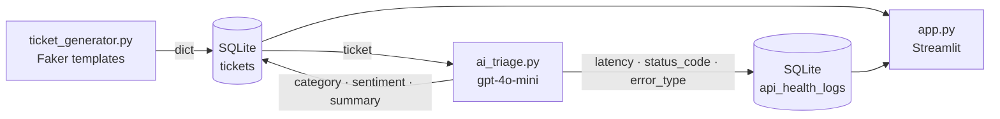

# Building SupportOps AI Monitor — What I Learned

*Published: March 2026 · Reading time: ~10 min*

---

I wanted to understand what enterprise AI platform support actually looks like from an operational standpoint. Not the ML side — the infrastructure and workflow side. What kinds of tickets does a company like OpenAI or Anthropic deal with at scale? How does a team triage hundreds of requests a day? What does API reliability monitoring actually look like when it's hooked up to a real dashboard?

The honest answer: I didn't know. So I built something to find out.

This is a writeup of what I built, the decisions I made, and — more usefully — the things I got wrong.

---

## What the Project Does

SupportOps AI Monitor simulates a complete support operations workflow for an AI platform:

1. **Ticket generation** — Faker-powered templates produce realistic support tickets across five categories: API errors, billing disputes, account issues, safety concerns, and general inquiries. The subject lines, bodies, and customer names look like real tickets.

2. **AI triage** — Each ticket is sent to `gpt-4o-mini`, which assigns a category, assesses customer sentiment (positive/neutral/negative), and generates a one-line summary. The system prompt is strict JSON — the model is asked to return only `{"category": ..., "sentiment": ..., "summary": ...}`.

3. **API health logging** — Every triage call (real or simulated) records: endpoint, HTTP status code, response latency in milliseconds, success/failure, and error type. This mirrors how observability tools like Datadog or Splunk track API reliability.

4. **Operational dashboard** — A Streamlit + Plotly frontend visualises all of it: ticket volume, priority distribution, sentiment trends, error rate over time, and latency histograms.

The whole thing runs completely in simulation mode with no API key required. The simulation uses a Gaussian latency distribution (mean 820ms, σ 200ms) and a 10% failure rate across 429/500/408 status codes — realistic enough to make the dashboard interesting without costing anything.



---

## Architecture Decisions (and Why)

### Four modules, one-way pipeline

```
ticket_generator.py → database.py → ai_triage.py → database.py
```

I kept this strictly linear. `app.py` only orchestrates and renders — no business logic, no SQL. `database.py` owns all persistence. `ai_triage.py` owns all inference. This made reasoning about failures much easier: if a triage call fails, I know exactly where to look.

The main alternative I considered was merging triage and generation into a single pipeline script. I'm glad I didn't — keeping them separate meant I could triage already-generated tickets, re-triage specific tickets, and develop the simulation mode independently.

### SQLite, not PostgreSQL

SQLite was the right call for a portfolio project with no deployment target defined. It's zero-configuration, the file is inspectable with any SQLite browser, and the schema is readable without any external tooling.

The tradeoff: SQLite makes cloud deployment awkward. The filesystem on containerised platforms (Streamlit Cloud, Heroku, Render) is ephemeral — the database resets on every restart. If I were building this for real, or deploying it to something like Hugging Face Spaces, I'd either mount a persistent volume or swap `database.py` for a `psycopg2`/Supabase backend. The schema queries are standard enough that the swap would be ~50 lines.

### Simulation mode as first-class citizen

The most useful architectural decision I made was treating simulation mode as the primary mode, not a fallback. From the beginning, the simulation was designed to produce *realistic* data, not just placeholder data. Gaussian latency, real error class proportions (429/500/408), specific error type labels — the dashboard looks live even when nothing has touched the OpenAI API.

This matters for demos. It matters for development. And it forced me to think clearly about what the observability data *should* look like before I wrote any real triage logic.

---

## What I Learned Building It

| Issue | Root cause | Fix |
|-------|------------|-----|
| `applymap()` crash at runtime | `pandas >= 2.2` removed it from Styler API | `.map()` — one word change |
| `pip install` fails on Python 3.14 | Exact version pins (`==`), no pre-built wheels | Minimum-version pins (`>=`) |
| Dashboard shows stale data after writes | `@st.cache_data` with no invalidation logic | `data_version` counter in session state |
| SQLite connection leaks on exceptions | `conn.close()` only on success path | `try/finally` wrapping every DB function |

### The `applymap()` bug

The original code used `df.style.applymap(...)` to colour-code the ticket queue table. This is a guaranteed crash on `pandas >= 2.2.0` — `.applymap()` was removed from the Styler API and replaced with `.map()`.

The bug was completely invisible during development because I was on an older pandas. The fix was a one-word change: `applymap` → `map`. But the lesson was about dependency pinning.

I initially pinned everything with exact versions (`pandas==2.2.1`, `streamlit==1.32.0`). This felt safe. It wasn't — on Python 3.14, none of those packages had pre-built wheels, so `pip install` tried to compile pandas from source and failed. I had to switch to minimum-version pins (`pandas>=2.2.1`), which let pip pull the latest compatible wheels.

The real lesson: exact pins are not the same as reproducible builds. If you want reproducibility, you need a lockfile (Poetry's `poetry.lock`, pip-compile, or uv's lockfile). Bare `requirements.txt` with exact pins is the worst of both worlds on unsupported Python versions.

### Connection lifecycle and try/finally

The original `database.py` opened a connection, executed a query, committed, and closed — but only on the success path. An exception anywhere in between left the connection open indefinitely.

```python
# Before — connection leak on any exception
def insert_ticket(ticket):
    conn = get_connection()
    conn.execute(INSERT_SQL, ticket)
    conn.commit()
    conn.close()  # never reached if execute() throws

# After — always closes
def insert_ticket(ticket):
    conn = get_connection()
    try:
        conn.execute(INSERT_SQL, ticket)
        conn.commit()
    finally:
        conn.close()
```

Every single database function needed this. SQLite is forgiving about this at low volume, but it's the kind of thing that causes mysterious failures under load or in long-running processes. It's also just correct Python.

### Cache busting in Streamlit

`@st.cache_data` caches the return value of a function based on its arguments. If you call `get_all_tickets()` with no arguments, it caches forever (or until TTL). After generating new tickets, the dashboard would show stale data.

The standard Streamlit pattern for this is a version counter:

```python
if "data_version" not in st.session_state:
    st.session_state.data_version = 0

@st.cache_data(ttl=60)
def load_all_tickets(_version):  # underscore prefix = not hashed, but changes bust cache
    return db.get_all_tickets()

# After any write:
st.session_state.data_version += 1
tickets = load_all_tickets(st.session_state.data_version)
```

The `_version` parameter with the underscore prefix is the trick. Streamlit doesn't hash it as a cache key — it just sees a new argument value and invalidates the cache. Clean and explicit.

### What "design tokens" actually means in practice

The original `app.py` had colours scattered everywhere: `"#e74c3c"` in one chart, `"#ef4444"` in a badge, `"red"` in a metric. No consistency, no central reference. Adding a new chart meant picking a colour by eye.

Replacing all of this with a single `COLORS` dict at the top of the file took about 20 minutes but made every subsequent change trivial:

```python
COLORS = {
    "danger":  "#f87171",
    "warning": "#fb923c",
    "success": "#4ade80",
    "accent":  "#C9A84C",
    ...
}
PRIORITY_COLORS = {
    "critical": COLORS["danger"],
    "high":     COLORS["warning"],
    "medium":   "#facc15",
    "low":      COLORS["success"],
}
```

The payoff is that changing the danger colour from `#f87171` to anything else now updates every chart, badge, and indicator simultaneously. That's what design tokens are — not a framework, just named constants for visual values.

---

## What I'd Do Differently

**Service layer abstraction.** Right now `app.py` calls `database.py` and `ai_triage.py` directly. A thin service layer — `TicketService.generate_and_triage(n)` — would make the business logic testable without Streamlit. As it stands, there are no unit tests because everything is tangled with the UI.

**PostgreSQL from the start.** SQLite is great for local development, but every cloud deployment path hits the ephemeral filesystem problem. Starting with Supabase (free tier, standard PostgreSQL) and `psycopg2` would have made deployment a non-issue.

**Asynchronous triage.** Triaging 100 tickets takes several minutes because each call is sequential and the simulation includes a sleep to fake latency. An `asyncio` + `ThreadPoolExecutor` pattern would let 10–20 triage calls run in parallel. This is a meaningful UX improvement for larger batches.

**JSON output validation.** The triage prompt asks for strict JSON. The code does `json.loads(raw)`. If the model hallucinates a markdown code fence around the JSON (which happens), the parse fails and the ticket gets logged as an error. A repair step — strip fences, retry once — would make real-API mode much more robust.

---

## Deployment Challenges

### SQLite + ephemeral containers

Streamlit Community Cloud, Heroku, and Render all run in containers where the filesystem resets on every deploy or restart. The `db/supportops.db` file disappears. Every demo starts with an empty database.

| Platform | Persistence | Code change required | Best for |
|----------|-------------|----------------------|----------|
| **HuggingFace Spaces** | `/data` dir persists between restarts | Change `DB_PATH` to `/data/supportops.db` | Fast live demo — recommended first step |
| **Supabase + Streamlit Cloud** | PostgreSQL, always-on | Swap `database.py` to `psycopg2` (~50 lines) | Production-grade persistence |
| **Railway / Render + volume** | Docker volume at `/app/db` | Mount volume in Docker config | Full infrastructure control |
| **Streamlit Community Cloud** | ❌ Ephemeral — resets on restart | N/A | Not viable with SQLite |

### Streamlit and the `<head>` tag

I wanted to add PWA support (manifest.json, service worker, meta tags) directly to the Streamlit app. Streamlit doesn't allow this. There's no Python API to inject into the HTML `<head>` — you can do `st.markdown()` with `unsafe_allow_html=True` for body content, but not for head elements.

The correct solution for a Streamlit project that needs SEO or PWA functionality is a separate static landing page (GitHub Pages, Netlify) that links to the live app. The landing page handles the meta tags, Open Graph images, and manifest. The Streamlit app handles the actual functionality.

This is a framework limitation worth knowing before you start, not after.

---

## What Amey Asked (and I Couldn't Answer at First)

A friend who works in ML infrastructure reviewed the project and asked a few questions I didn't have immediate answers to:

**"Why SQLite and not a proper database?"**
At the time I said "simplicity." The real answer: I hadn't thought through the deployment path yet. SQLite is correct for local demo use and costs nothing. It becomes a problem the moment you want a persistent URL to share.

**"What happens to your data between deploys?"**
It disappears. I didn't have a good answer for this at review time. I do now — see the deployment section above.

**"Why is the git history so flat?"**
Fair point. The repo was initialised after the project was already working, so the commit history didn't reflect the development journey. Going forward: every meaningful change gets its own commit with a specific message. The history grows from here, and that's authentic.

**"How would you test the triage logic?"**
Honestly, you'd need to extract it from the Streamlit context first. The triage function is testable in isolation — you can call `triage_ticket(ticket_dict)` directly and assert on the returned fields. The blocker is that there are no tests. Adding a `pytest` suite that calls `_simulate_triage()` with known inputs and checks the output structure would be the right first step.

---

## What's Next

- **Persistent deployment** via Hugging Face Spaces (near-term) and Supabase + Streamlit Cloud (longer term)
- **Test suite** — `pytest` around generator schema, DB CRUD, and triage output contract
- **Model quality panel** — show generated "ground truth" category vs AI-assigned category side by side; this turns the tool from a monitoring dashboard into a model evaluation dashboard
- **Async triage** for large batches
- **CLI commands** for seeding and resetting the DB without Streamlit

---

## Resources

- [Repository](https://github.com/Archit-Konde/supportops-ai-monitor)
- [Streamlit docs — caching](https://docs.streamlit.io/develop/concepts/architecture/caching)
- [OpenAI API reference](https://platform.openai.com/docs/api-reference)
- [SQLite — when to use it](https://www.sqlite.org/whentouse.html)
- [pandas Styler migration guide (applymap → map)](https://pandas.pydata.org/docs/whatsnew/v2.2.0.html)
