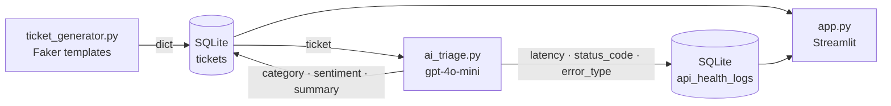
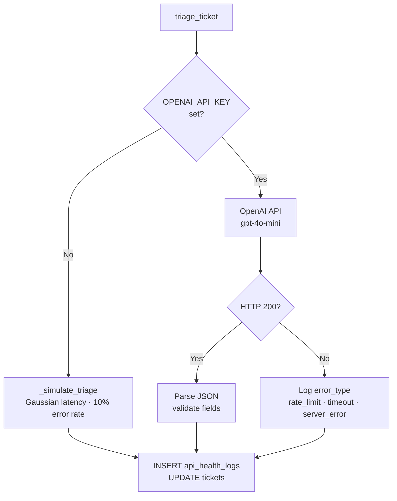

# Architecture

> Technical deep-dive into SupportOps AI Monitor internals.
> For a quick overview, see the [README](https://github.com/Archit-Konde/supportops-ai-monitor).

---

## System Architecture



### Module Responsibilities

| Module | Location | Role |
|--------|----------|------|
| `ticket_generator.py` | `src/` | Generates realistic ticket dicts from 5 Faker-powered templates (api, billing, account, safety, other) |
| `database.py` | `src/` | All SQLite operations — `INSERT`, `UPDATE`, `SELECT`. Short-lived connections (`open → execute → close`). Uses `INSERT OR IGNORE` to prevent duplicates |
| `ai_triage.py` | `src/` | Calls OpenAI `gpt-4o-mini` to classify category, sentiment, and produce a one-line summary. Falls back to simulation when no API key is present |
| `app.py` | `src/` | Streamlit dashboard — rendering only, no business logic. Calls the other three modules, renders Plotly charts, sidebar controls |

---

## Triage Flow



---

## Database Schema

Two tables in `db/supportops.db` (created automatically by `database.init_db()`).

### `tickets`

| Column | Type | Description |
|--------|------|-------------|
| `ticket_id` | TEXT | Unique identifier (`TKT-XXXXXXXX`) |
| `created_at` | TEXT | ISO timestamp |
| `customer` | TEXT | Company name |
| `subject` | TEXT | Ticket subject |
| `body` | TEXT | Full description |
| `priority` | TEXT | `low` / `medium` / `high` / `critical` |
| `status` | TEXT | `open` / `in_progress` / `resolved` |
| `category` | TEXT | AI-assigned: `api` / `billing` / `account` / `safety` / `other` |
| `sentiment` | TEXT | AI-assigned: `positive` / `neutral` / `negative` |
| `ai_summary` | TEXT | One-line AI-generated summary |
| `resolved_at` | TEXT | Resolution timestamp |

### `api_health_logs`

| Column | Type | Description |
|--------|------|-------------|
| `timestamp` | TEXT | ISO timestamp of API call |
| `endpoint` | TEXT | API endpoint called |
| `status_code` | INTEGER | HTTP response code |
| `latency_ms` | REAL | Response time in milliseconds |
| `success` | INTEGER | `1` = success, `0` = failure |
| `error_type` | TEXT | `rate_limit` / `server_error` / `timeout` / `null` |
| `ticket_id` | TEXT | Associated ticket |

---

## Simulation Mode

When `OPENAI_API_KEY` is absent, the app falls back to `_simulate_triage()` which models realistic API behaviour:

- **Latency** — Gaussian distribution (mean ~820ms, sigma 200ms, clamped to 200-2000ms)
- **Error rate** — 10% failure rate across three error types
- **HTTP status codes** — 200, 429, 500, 408 in realistic proportions
- **Categories** — randomly assigned from the 5 valid categories
- **Sentiment** — randomly assigned from positive / neutral / negative

The simulation generates observability data that is indistinguishable from real API calls in the dashboard charts. The full dashboard is demonstrable at zero cost.

---

## Data Pipeline

```
ticket_generator.py  →  database.py  →  ai_triage.py  →  database.py
       ↓                     ↓                ↓
  generates dicts       INSERT tickets    UPDATE ai fields
                                           + INSERT api logs
```

**Key convention:** The `category` field is set twice — once by the generator (as ground truth) and again by `ai_triage.update_ticket_ai_fields()`. The database value always reflects the AI-assigned category after triage runs.
